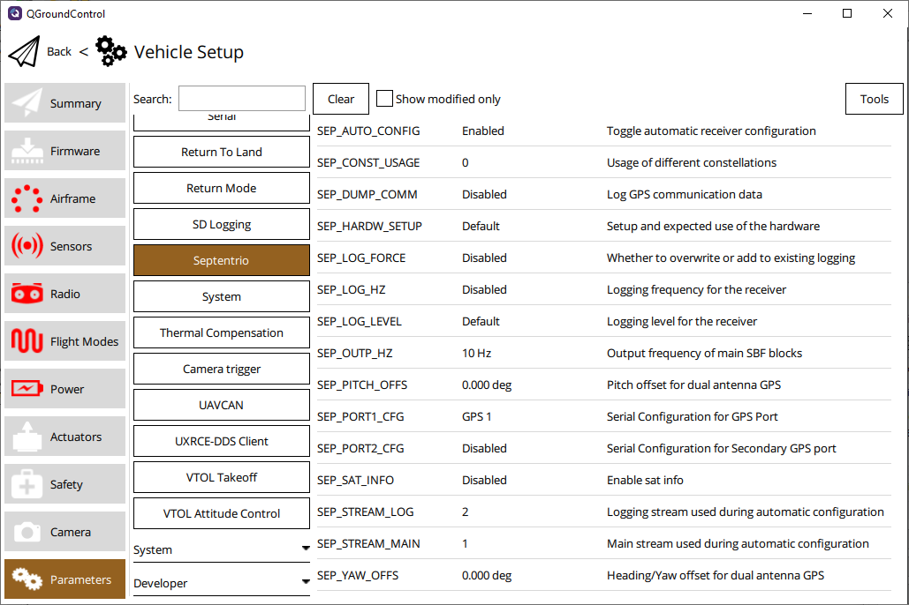

# Getting Started Guide

- [Hardware Setup](#hardware-setup)
    - [Dual Antenna](#dual-antenna)
    - [Web App](#web-app)
- [PX4 Setup](#px4-setup)
    - [Single Antenna Setup](#single-antenna-setup)
    - [Dual Antenna Setup](#dual-antenna-setup)
- [LED Status](#led-status)

This guide explains how to connect and configure autopilot hardware running [PX4](https://px4.io/)
to work with a [Septentrio receiver](https://web.septentrio.com/GH-SSN-RX).

## Hardware Setup

The first step is to connect the receiver to your autopilot hardware. There are many types of
receivers and autopilots. Therefore it is important to consult the documentation for your specific
hardware to know what connector is needed.

Below are two example setups.

| Pixhawk 4 & mosaic-go                           | Pixhawk 4 & RIB Board                     |
|:-----------------------------------------------:|:-----------------------------------------:|
|  |  |

1. Power the receiver with at least 5V, using either a USB connector or power from the connection
   to the autopilot
2. Connect one or two GNSS antennas to the "RF-IN" ports on the receiver
3. Connect the receiver to the autopilot hardware like in the diagrams above

**When using a mosaic-go, make sure the JST cable is wired correctly as it is not a standard cable.
Below is the wiring diagram.**

### Dual Antenna

The attitude (vehicle orientation) can be computed by the receiver and provided to the autopilot
based on the baseline between the main and auxiliary GNSS antennas.

To enable multi-antenna attitude, follow the steps below:

1. Attach two antennas to your vehicle, using cables of approximately the same length. The default
   antenna configuration is as depicted in the figure above. It consists in placing the antennas
   aligned with the longitudinal axis of the vehicle, main antenna behind aux1. For best accuracy,
   try to maximize the distance between the antennas, and avoid significant height difference
   between the antenna ARPs.
2. In practice, the two antenna ARPs may not be exactly at the same height in the vehicle frame, or
   the main-aux1 baseline may not be exactly parallel or perpendicular to the longitudinal axis of
   the vehicle. This leads to offsets in the computed attitude angles. These offsets can be
   compensated for with the `GPS_YAW_OFFSET` and `GPS_PITCH_OFFSET` parameters, which can be set
   from your ground control station.

_For optimal heading results, the two antennas should be seperated at least 30 cm / 11.8 in (ideally
50 cm / 19.7 in or more)_

_For additional configuration of the dual antenna setup, please refer to our [Knowledge
Base](https://customersupport.septentrio.com/s/topiccatalog) or the [hardware
manuals](https://www.septentrio.com/en/support/product-resources)_

### Web App

mosaic-H GPS/GNSS receiver module with heading comes with fully documented interfaces, commands and
data messages. The included GNSS receiver control and analysis software
[RxTools](https://web.septentrio.com/l/858493/2022-04-19/xgrqp) allows receiver configuration,
monitoring as well as data logging and analysis.

The receiver includes an intuitive web user interface for easy operation and monitoring allowing you
to control the receiver from any mobile device or computer. The web interface also uses easy-to-read
quality indicators ideal to monitor the receiver operation during the job at hand.

## PX4 Setup

### Single Antenna Setup

Edit the following parameters in the PX4 setup page:

|                 | v1.13.0          | v1.14.0          | v1.14.0-septentrio1 |
|-----------------|------------------|------------------|---------------------|
| GPS_1_CONFIG    | GPS 1            | GPS 1            | GPS 1               |
| GPS_AUTO_CONFIG | \/               | \/               | Enabled             |
| GPS_1_GNSS      | 31               | 31               | 31 (unused)         |
| GPS_1_PROTOCOL  | Septentrio (SBF) | Septentrio (SBF) | Septentrio (SBF)    |
| SER_GPS1_BAUD   | 115200 8N1       | 115200 8N1       | 115200 8N1          |

Go to **Tools > Reboot Vehicle**

### Dual Antenna Setup

Edit the following parameters in the PX4 setup page:

|                  | v1.13.0              | v1.14.0                        | v1.14.0-septentrio1            |
|------------------|----------------------|--------------------------------|--------------------------------|
| GPS_1_CONFIG     | GPS 1                | GPS 1                          | GPS 1                          |
| GPS_AUTO_CONFIG  | \/                   | \/                             | Enabled                        |
| GPS_1_GNSS       | 31                   | 31                             | 31 (unused)                    |
| GPS_1_PROTOCOL   | Septentrio (SBF)     | Septentrio (SBF)               | Septentrio (SBF)               |
| GPS_PITCH_OFFSET | Set accordingly      | Set accordingly                | Set accordingly                |
| GPS_YAW_OFFSET   | Set accordingly      | Set accordingly                | Set accordingly                |
| SER_GPS1_BAUD    | 115200 8N1           | 115200 8N1                     | 115200 8N1                     |
| EKF2_AID_MASK    | Use GPS & GPS fusion | \/                             | \/                             |
| EKF2_GPS_CTRL    |                      | Dual antenna heading (include) | Dual antenna heading (include) |

Go to **Tools > Reboot Vehicle**

### Automatic Configuration

By default, PX4 automatically sets up the connected receiver when all parameters are correct. This
can be disabled by setting `GPS_AUTO_CONFIG` to `Disabled`, which can be useful when the receiver is
used for other purposes than autopilots alone. In that case, it may be the easiest to connect the
receiver to the autopilot first, let the autopilot set it up, and then disable autoconfig in order
to not overwrite custom configuration on top of the automatic autopilot one.

## LED Status

The LED on the receiver gives some information about the current status. The following table
describes the different colors and their meaning.

| LED Color     | Powered  | SD Card Mounted | PVT Solution | Logging Enabled |
|---------------|:--------:|:---------------:|:------------:|:---------------:|
| Red           | &check;️  |                 |              |                 |
| Green         | &check;️  | &check;️         |              |                 |
| Blue          | &check;️  | &check;️         | &check;️      |                 |
| Purple        | &check;️  |                 | &check;️      |                 |
| Purple + Blue | &check;️  | &check;️         | &check;️      | &check;️         |
| Red + Green   | &check;️  | &check;️         |              | &check;️         |

For more detailed information about the hardware or setup, refer to the [Septentrio
Support](https://www.septentrio.com/en/support/product-resources) pages.